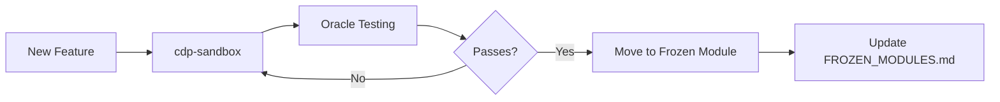

# CDP-RS Architecture

## Project Structure

```
cdp-rs/
├── cdp-core/        # FROZEN: Core DSP primitives
├── cdp-pvoc/        # FROZEN: Phase vocoder (after validation)
├── cdp-spectral/    # FROZEN: Spectral processors (after validation)
├── cdp-oracle/      # Testing framework using CDP as ground truth
├── cdp-sandbox/     # ACTIVE: Safe for LLM modification
└── cdp-examples/    # Demonstration code
```

## Key Design Decisions

### 1. Oracle Testing
CDP binaries serve as the "oracle" - the source of truth for all implementations:
- Every Rust function is validated against CDP's output
- No manual test cases needed - CDP IS the test suite
- 35+ years of validation inherited automatically

### 2. Frozen Module Pattern
Once validated, modules become immutable:
- `#![forbid(unsafe_code)]` prevents accidental changes
- CI/CD blocks any modifications to frozen modules
- LLMs can only work in the sandbox

### 3. Workspace Isolation
- **Frozen modules**: Production-ready, validated code
- **Sandbox**: Experimental area for new development
- **Oracle**: Testing infrastructure that validates against CDP

## Development Workflow



## Why This Architecture?

### Problem: LLMs Break Working Code
**Solution**: Frozen modules that can't be modified once validated

### Problem: Audio Testing is Hard
**Solution**: Use CDP binaries as the test oracle - they define correctness

### Problem: 500+ Programs to Port
**Solution**: Incremental validation - one program at a time

### Problem: LGPL License Compatibility
**Solution**: Respect original license while building clean implementation

## Next Steps

1. **Install CDP binaries** for oracle testing
2. **Implement phase vocoder** in sandbox
3. **Validate against CDP** using oracle
4. **Move to cdp-pvoc** and freeze
5. **Repeat for all 500 programs**

## For LLM Development

### Safe to Modify
- `cdp-sandbox/` - All experimental code
- `cdp-examples/` - Demo applications
- Tests in any module

### Never Modify
- `cdp-core/` - Frozen after validation
- `cdp-pvoc/` - Frozen after validation
- `cdp-spectral/` - Frozen after validation

### How to Add New Processors

1. Create in `cdp-sandbox/src/experiments.rs`
2. Implement `CdpProcessor` trait
3. Run oracle validation
4. Move to appropriate frozen module
5. Update documentation

## Testing Strategy

### Level 1: Oracle Tests
```rust
validator.validate(&processor, &test_signal, 44100)
```

### Level 2: Property Tests
```rust
#[quickcheck]
fn preserves_energy(input: Vec<f32>) -> bool
```

### Level 3: Perceptual Tests
```rust
assert!(pesq_score > 4.0); // Excellent quality
```

## Performance Goals

- Match or exceed CDP's processing speed
- Enable real-time processing (CDP is batch-only)
- Support SIMD acceleration
- Zero-copy where possible

## License Considerations

- CDP-RS uses LGPL-2.1 to match CDP
- Allows commercial use with dynamic linking
- Future MIT version possible with clean-room implementation
- All contributions must be LGPL-compatible